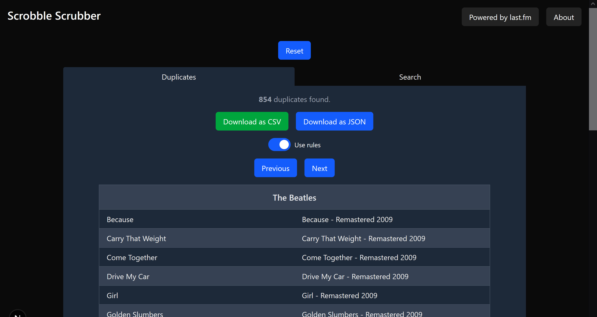

# Split Scrobble Finder V2

---



## Background

This web app allows you to scan your Last.fm profile for split scrobbles, which can arise when streaming services change the metadata of a track, album or artist, such as adding a feature tag to the track title.

Switching between music streaming platforms can also create split entries in your Last.fm profile, given that metadata is generally not standardized among all platforms.

This is V2 of the app, as my [first version](https://github.com/alexbisaillion/split-scrobble-finder) fell into disrepair when Heroku removed its free tier.

## Usage

The app is live at https://split-scrobble-finder-v2.vercel.app/.

Simply input your username and select either tracks, albums, or artists to scan your profile for split scrobbles.

There is an option to "use rules". Selecting this option will use a custom rule set I developed to help eliminate false split scrobbles. For example, "Human After All" and "Human After All - SebastiAn Remix" would not be detected as split scrobbles if the rule set is enabled. Otherwise, standard string similarity would be used, which would result in those two tracks being detected as a duplicate.

I recommend trying requests in both fashions. If you find that the rule set fails to detect true split scrobbles or falsely identifies split scrobbles, feel free to raise an issue here on GitHub or message me with the issue. The rule set algorithm can always be improved!

Note that request times can be significant, as it requires numerous strenuous calls to the Last.fm API.

Once your results have been fetched, you can scroll through the detected split entries, where each entry provides a hyperlink to the specified track/album/artist in your library on the Last.fm site. You can then edit the scrobbles as desired on Last.fm.

You can also download your results in either JSON or CSV format, so you don't have to keep waiting for your results to be generated if you want to view your results again.

## Getting Started

To run this app locally, you must have your own Last.fm API credentials. See [here](https://www.last.fm/api/account/create) for more details.

Once you have an API key, create a `.env.local` file in the root directory and add the key. The file should look as follows:

```
LAST_FM_API_KEY=somealphanumericvalue
```

Next, run the development server:

```bash
npm run dev
# or
yarn dev
# or
pnpm dev
# or
bun dev
```

Open [http://localhost:3000](http://localhost:3000) with your browser to see the result.

## Testing

There is a set of tests written to ensure the duplication detection algorithm works for various tag differences I have found in my own library.

Simply run the following in the root directory to run these tests:

```
npm run test
```

## Technical Specs

This is a [Next.js](https://nextjs.org) project bootstrapped with [`create-next-app`](https://nextjs.org/docs/app/api-reference/cli/create-next-app).

The dependencies for this have been kept to a bare minimum, relying only on React and Next.js. Tailwind is used for the CSS. Keeping the app lightweight ensures it won't fall into disrepair again due to outdated dependencies.
